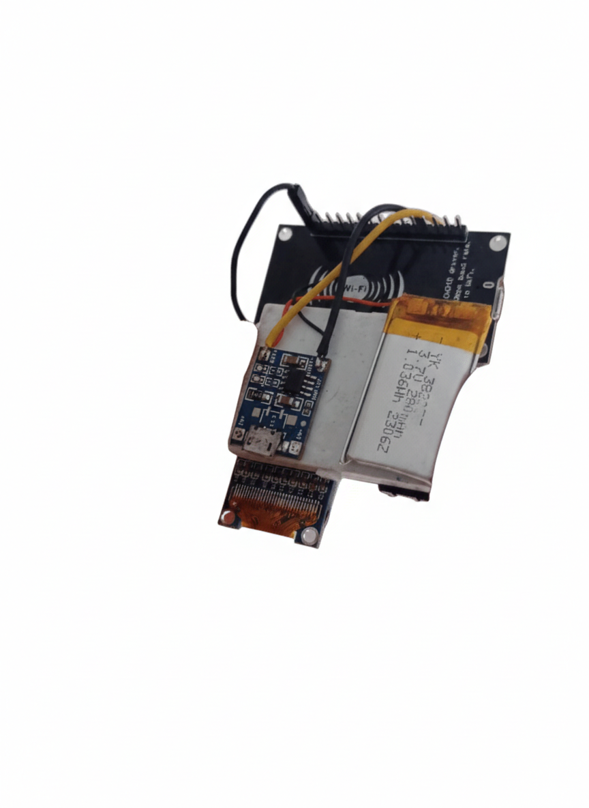

# Display-Oled-128x64-Gr-fico-I2C-Serial-0.96-ssd1306

  

# 📟 ESP8266 NTP OLED Clock

Firmware para **ESP8266** que implementa um **relógio sincronizado via NTP**, com interface em **display OLED SSD1306**, **configuração de Wi-Fi usando apenas um botão** e **monitoramento do nível de bateria**.

O projeto foi desenvolvido com foco em **simplicidade de hardware**, **baixo consumo de energia** e **interface embarcada minimalista**, **sem uso de RTC externo**.

---

## ✨ Funcionalidades

- ⏰ Relógio sincronizado via **NTP (Network Time Protocol)**
- 📅 Exibição de **data e hora**
- 📶 **Configuração de Wi-Fi diretamente no dispositivo** (sem hardcode)
- 🔘 Interface controlada por **um único botão**
- 🔋 **Indicador de nível de bateria (%)** via ADC
- 🖥️ Display **OLED 128×64 SSD1306 (I²C)**
- ❌ Sem uso de **RTC externo**
- ❌ Sem APIs externas além do **NTP**

---

## 🧰 Hardware Utilizado

- ESP8266 (NodeMCU ou compatível)
- Display OLED **0.96" 128×64 SSD1306 (I²C)**
- 1 botão push (utilizando pull-up interno)
- Bateria **Li-ion / Li-Po**
- Divisor resistivo para medição da bateria:
  - **330kΩ** (resistor superior)
  - **100kΩ** (resistor inferior)

---

## 🔌 Ligações (Pinout)

### OLED (I²C)

| OLED | ESP8266 |
|----|----|
| SDA | GPIO4 (D2) |
| SCL | GPIO5 (D1) |
| VCC | 3.3V |
| GND | GND |

---

### Botão Push

| Botão | ESP8266 |
|----|----|
| Um lado | GPIO12 (D6) |
| Outro lado | GND |

> O botão utiliza `INPUT_PULLUP`, portanto o acionamento ocorre ao conectar o pino ao GND.

---

### Bateria (ADC)

| Ponto | ESP8266 |
|----|----|
| Saída do divisor | A0 |
| GND | GND |

**Divisor resistivo:**

Bateria + ---- 330kΩ ----+---- 100kΩ ---- GND
|
A0

---

## 🔘 Funcionamento do Botão

| Ação | Função |
|----|----|
| Clique curto | Navegar entre opções |
| Pressão média | Selecionar caractere |
| Pressão longa | Confirmar / conectar Wi-Fi |

O botão é utilizado para:

- Selecionar redes Wi-Fi
- Inserir a senha
- Re-sincronizar o relógio via NTP

---

## 🔋 Medição da Bateria

A tensão da bateria é medida através do **ADC do ESP8266**, utilizando um **divisor resistivo de 330kΩ / 100kΩ**.

A leitura é convertida para:

- **Tensão estimada**
- **Porcentagem de carga (0–100%)**

A calibração pode ser ajustada diretamente no código conforme o tipo e estado da bateria utilizada.

---

## 📚 Bibliotecas Utilizadas

- **ESP8266 Arduino Core**  
  https://arduino-esp8266.readthedocs.io/

- **Adafruit SSD1306**  
  https://github.com/adafruit/Adafruit_SSD1306

- **Adafruit GFX**  
  https://github.com/adafruit/Adafruit-GFX-Library

- **NTPClient**  
  https://github.com/arduino-libraries/NTPClient

---

## 🛠️ Como Compilar

1. Instale o **Arduino IDE**
2. Adicione o suporte ao **ESP8266**
3. Instale as bibliotecas listadas acima
4. Selecione a placa correta (ex: **NodeMCU 1.0**)
5. Compile e faça o upload do firmware

---

## 📌 Limitações Conhecidas

- A hora não é mantida sem energia (não há RTC)
- A precisão depende da sincronização inicial via Wi-Fi
- A porcentagem da bateria é uma **estimativa linear**

---

## 🚀 Possíveis Evoluções

- Deep Sleep para economia de energia
- Curva não linear para baterias Li-ion
- Detecção de carregamento
- Múltiplas telas (status, configuração, informações)
- Animações e efeitos no OLED

---

## 📄 Licença

Este projeto utiliza bibliotecas **open-source** e foi desenvolvido para **fins educacionais e experimentais**.  
Sinta-se livre para estudar, modificar e adaptar.

---

## 👤 Autor

**Projeto desenvolvido por:** Jeferson  
**Área:** Sistemas Embarcados / Engenharia Elétrica
